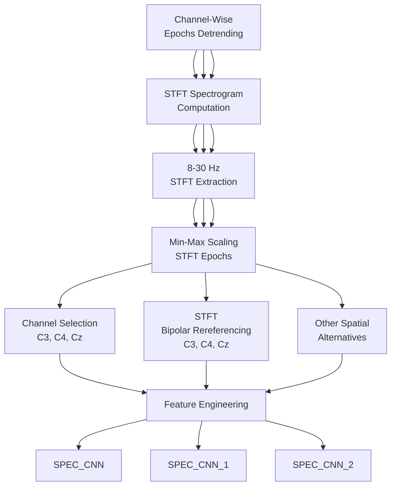
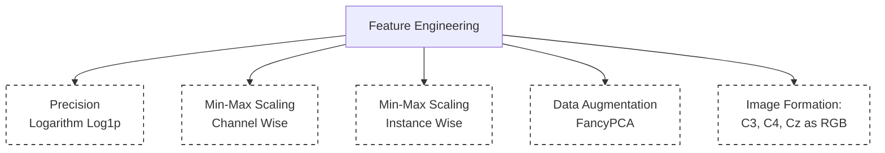

# elbow_MI

Stroke Motor-Imagery [Dataset](https://figshare.com/articles/dataset/EEG_datasets_of_stroke_patients/21679035/5)

Article [Link](https://www.nature.com/articles/s41597-023-02787-8)

## Pipeline

#### Feature Engineering
